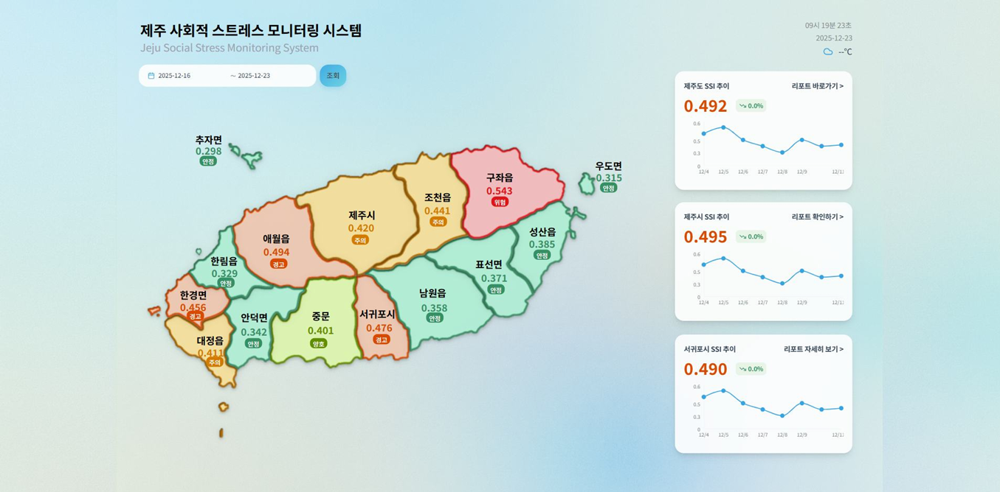
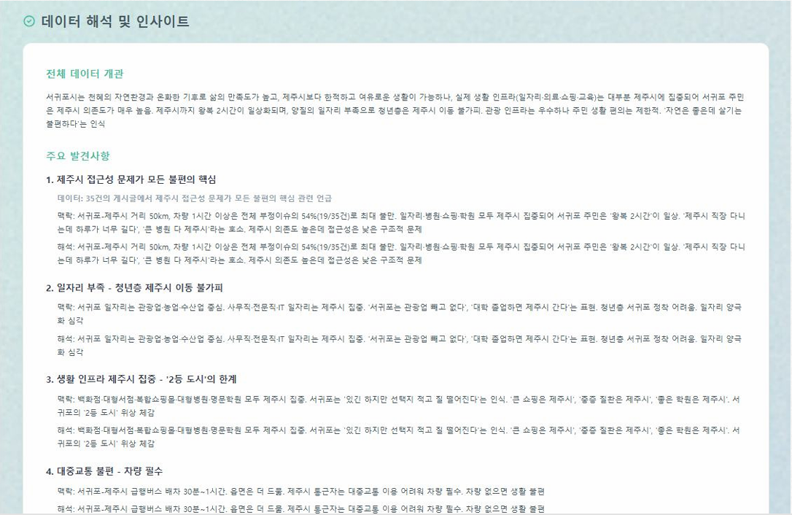

# 제주 사회적 스트레스 모니터링 시스템

> Jeju Social Stress Monitoring System

제주 지역의 소셜 미디어 데이터를 분석하여 지역별 사회적 스트레스 지수(SSI)를 시각화하는 대시보드

## 🖼️ 주요 화면

### 메인 대시보드



### 부정적 의견 분석


### 데이터 해석 및 인사이트



## 📌 프로젝트 소개

제주시는 전국의 자연환경과 온화한 기후로 삶의 만족도가 높지만, 실제 삶의 인프라(일자리·의료·쇼핑·교육)는 대부분 제주시에 집중되어 있습니다.

본 프로젝트는 소셜 미디어 데이터를 분석하여 제주 각 지역의 사회적 스트레스를 모니터링하고 시각화합니다.

### 주요 기능

- 📊 **지역별 SSI 시각화**: 제주 11개 지역의 실시간 스트레스 지수 모니터링
- 🗺️ **인터랙티브 지도**: 지역 클릭 시 상세 데이터 표시
- 📈 **트렌드 분석**: 시계열 차트로 스트레스 변화 추이 분석
- 💬 **감정 분석**: 부정적/중립/긍정 게시물 분류 및 주요 키워드 추출

## 🛠️ 기술 스택

### Frontend

- **React 18** + **TypeScript**
- **Tailwind CSS** - 스타일링
- **Recharts** - 데이터 시각화
- **Vite** - 빌드 도구

### Backend & Data

- **FastAPI** - REST API 서버
- **Supabase** - PostgreSQL 데이터베이스
- **Axios** - HTTP 클라이언트

### AI/ML

- **KcELECTRA** - 한국어 감정 분석
- **KoBERT** - 키워드 추출
- **GPT-4** - 텍스트 해석


<!--
## 🚀 시작하기

### 설치
```bash
git clone https://github.com/SUCRESUCCES/jejuEmotionMap.git
cd jejuEmotionMap
npm install
npm run dev
```

### 환경변수
```env
VITE_SUPABASE_URL=your_supabase_url
VITE_SUPABASE_ANON_KEY=your_supabase_key
```
-->

## 📂 프로젝트 구조
```
jejuEmotionMap/
├── src/
│   ├── components/       # React 컴포넌트
│   ├── shared/services/  # API 서비스
│   ├── hooks/           # Custom Hooks
│   └── utils/           # 유틸리티 함수
├── images/              # README 이미지
└── README.md
```

MIT License